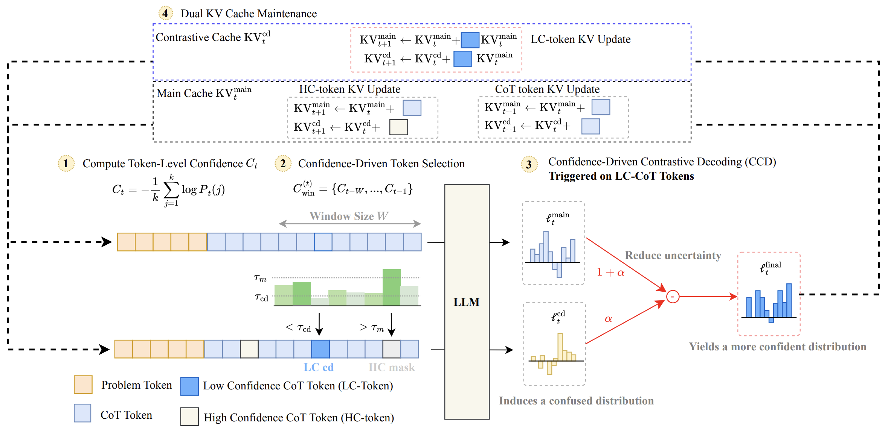
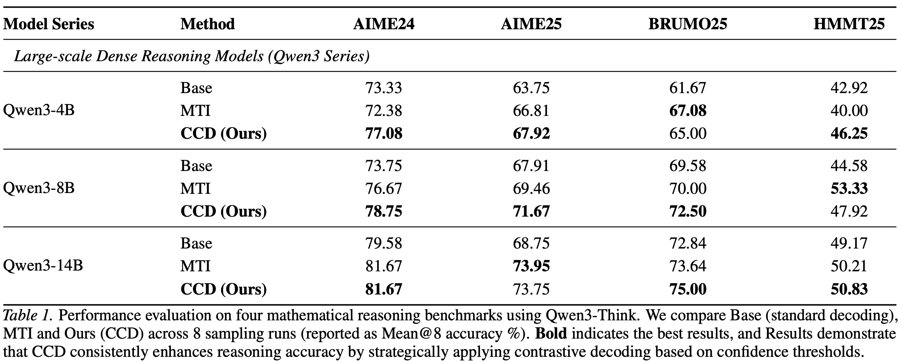
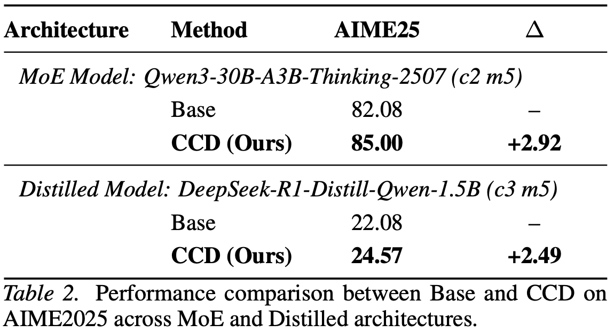

<p align="center">
  <h2 align="center">Thinking by Subtraction: Confidence-Driven Contrastive Decoding for LLM Reasoning</h2>
  <p align="center">
    Lexiang Tang, Weihao Gao, Bingchen Zhao, Lu Ma, Qiao Jin, Bang Yang, Yuexian Zou
    <br>
    <a href="https://arxiv.org/abs/2602.18232">
      
    </a>
  </p>
</p>


<!-- <p align="center"><b>We will release the code soon!</b></p> -->


## Getting Started
1. Create the environment and install the dependencies by running:
```
conda create -n ccd python=3.10 -y
conda activate ccd
pip install torch numpy transformers==4.56.1
```

2. Run with huggingface
```
python ccd.py
```


## TODO
1. More models
2. CCD on VLM


## Method


<p align="center">
  <table align="center">
    <td>
      </img>
    </td>
  </table>
</p>


### Main results

<p align="center">
  <table align="center">
    <td>
      </img>
    </td>
  </table>
</p>

<p align="center">
  <table align="center">
    <td>
      </img>
    </td>
  </table>
</p>


## BibTeX
```BibTeX
@misc{tang2026thinkingsubtractionconfidencedrivencontrastive,
      title={Thinking by Subtraction: Confidence-Driven Contrastive Decoding for LLM Reasoning}, 
      author={Lexiang Tang and Weihao Gao and Bingchen Zhao and Lu Ma and Qiao jin and Bang Yang and Yuexian Zou},
      year={2026},
      eprint={2602.18232},
      archivePrefix={arXiv},
      primaryClass={cs.CL},
      url={https://arxiv.org/abs/2602.18232}, 
}
```
